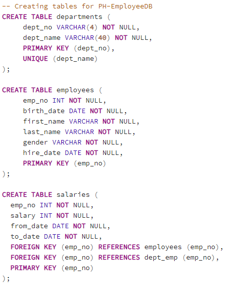
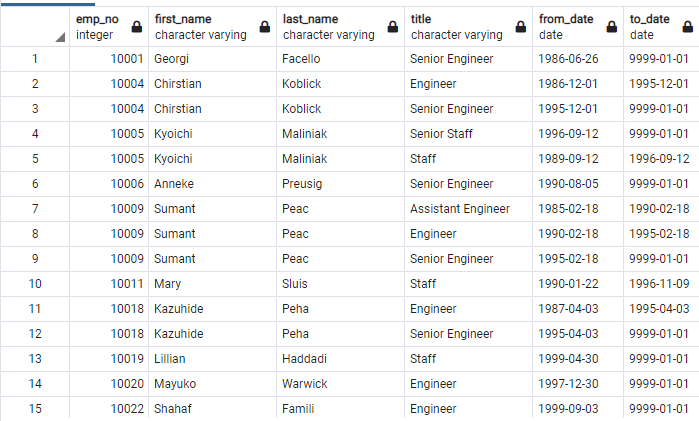
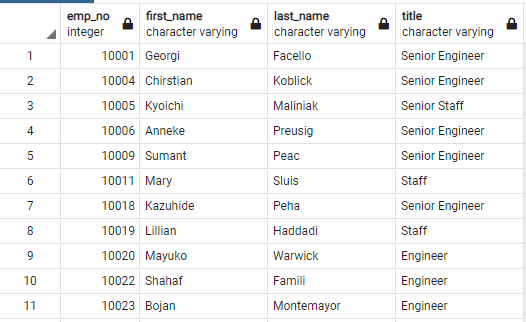
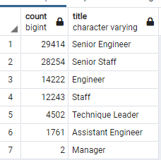
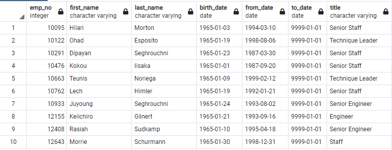
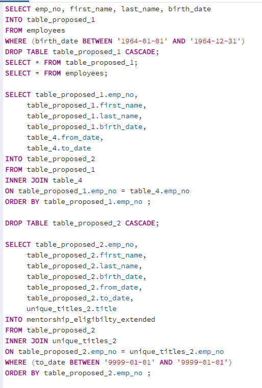
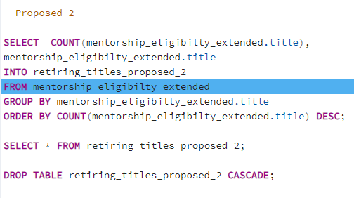
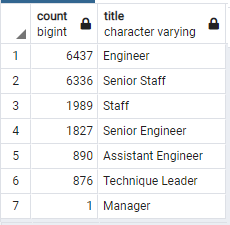

# Pewlett_Hackard_Analysis

## Overview of the Pewlett_Hackard_Analysis

### Background

SQL is a domain-specific language used in programming and designed for managing data held in a relational database management system. Pewlett Hackard is a large company boasting several thousand employees and it is been around for a long time. As baby boomers begin to retire at a rapid rate, the company is looking future in two ways. First, it is offering a retirement package for those who meet certain criteria. Second, it is starting to think about which positions will need to be fill in the near future. The number of upcoming retirements will leave thousands of jobs opening.  

### Purpose

The main purpose of this project is provide an analysis on how determine the number of retiring employees per title, and identify employees who are eligible to participate in a mentorship program into Pewlett Hackard through the construction of a employee database with SQL in order to develop an employee research with the HR to future-proof Pewlett Hackard by generating the employees series of csv documents that include  'retirng titles', 'unique titles' , 'retirement by title'and 'mentorship eligibility'.  

## Analysis

The first part for this project consisted in create tables importing data from different dataset to create the reference for the next steps. The following codes were used to create tables for dep_manager, dep_employee, titles, departments, employees and salaries.

### The Number of Retiring Employees by Title

In order to define the Retiring Employees by Title, it was necesary retrieve the emp_no, first_name, and last_name columns from the Employees table. Also, Retrieve the title, from_date, and to_date columns from the Titles. It is important to mention that data coming from employees table was filtered just to considered birth date for employees between 1952-01-01 to 1955-12-31. Also, both data were retrieve and consolidate in new tables called "table_1" and "retirement_titles_2". 

Then, both tables were consolidate into retirement_titles to use it as a base for the first derivable. This was done using the functions SELECT() INTO(), FROM() AND INNER JOIN(), also ordering by employee number Below, it is an image related with the "retirement titles' obatined after the use of the previous code:

Then, it was used Dictinct with Orderby to remove duplicate rows, using the code "SELECT DISTINCT ON (emp_no)", obtaining the results as shows the image below:

To finallly count the unique titles into the retiring title table to group and order them to finally obtain the Number of Retiring Employees by Title as shows the image below:

### The Employees Eligible for the Mentorship Program

In the Employee_Database_challenge.sql file, it was write a query to create a Mentorship Eligibility table that holds the employees who are eligible to participate in a mentorship program.
The first step was retrieve the emp_no, first_name, last_name, and birth_date columns from the Employees table, and also the retrieve the from_date and to_date columns from the Department Employee table and the title column from the Titles table.

Then, using DISTINCT ON statement to retrieve the first occurrence of the employee number for each set of rows defined by the ON () clause, it was created a new table using the INTO clause.Fianlly, the data was filtered on the to_date column to all the current employees, then filter the data on the birth_date columns to get all the employees whose birth dates are between January 1, 1965 and December 31, 1965.
Order the table by the employee number.

Exporting the Mentorship Eligibility table as mentorship_eligibilty.csv and saving it in the Data folder in the Pewlett-Hackard-Analysis folder, the result obntained looks like the image bellow:

## Results:

After the application of the rerspective code, it is possible observed that there are four major results in the analysis of the data:

1. After the application of the primary codes in the SQL, it is possible obtain a full list of employees filtered on the birth_date column who were born between 1952 and 1955 under the table "retirement_titles". Since this list consider all the changes over the time, there are duplicate entries for some employees because they have switched titles over the years and further analysis is required over the 133,776 employees list obtained in the table mentioned. 

2. Since there are duplicate entries for some employees because they have switched titles over the years, the table "unique_titles" was generated to remove these duplicates and keep only the most recent title of each employee. The resultant table shows 90,399 employees between different titles considering the contrains defined in the previous point, for example the employees who were born between 1952 and 1955 being part of the potential "silver tsunami".

3. Reviewing the "retiring_titles" provide important information about the overall situation of the company, retrieving the quantity by titles that could be retired bring a proactive approach to the company to understand what are the most critical titles that are going to need employees and also priotize them for the mentorship program. In this way, 32.5% of these titles are related with Senior Engineer and 31.3% with Senior Staff, being the most critical positions which need the implementation of actions. 

4. With the information analyzed before, the table mentorship_eligibilty provided a clear approach of possible mentors of the next generation of Pewlett Hackard employees. Employees whose birth dates are between January 1, 1965 and December 31, 1965 were identified resulting in 1,547 employees that could participate in the program.  

## Summary 

1. How many roles will need to be filled as the "silver tsunami" begins to make an impact?

A total of 7 unique levels need to be filled when the "silver tsunami" impact, including Senior Engineer, Senior Staff, Engineer, Staff, Technique Leader, Assistant Engineer and Manager, being the most critical Senior Engineer and Senior Staff with more that 63.8% of the positions (57,668 employees) over a total of 90,398 employees that will generate the "silver tsunami" in the company. In this way, one additional query that could be developed include identified how many Senior Staff and Senior Engineer are available to participate in the Mentorship Program, in order to guarantee the successful completion of the program based on the need identfied in the table unique_titles. 

2. Are there enough qualified, retirement-ready employees in the departments to mentor the next generation of Pewlett Hackard employees?

Reviweing the table "mentorship_eligibilty", there are 1,547 employees that could participate in the program, compared to 57,668 potential vacants positons that will be generate after the "silver tsunami' occurrs. This represent 37 employees per mentor, being a very high amount in the relation between mentor vs mentee. In this way, should be suggested increment the number of potential mentors in the program in order to achieve a quickly and effective process to cover all the positions available in the company. 

For this, a query is suggested to explore how many enough qualify employees could apply to mentor the next generation. In this way, a new table could be generated to consider later birth_date to obtained employees out of the current age of retirement, extending the years from 1964 to 1965 to define those that can fill the need as mentors in the program, under a new table called "mentorship_eligibilty_extended" calculating the employees by role born in 1964 in order the compare this new number as potential new mentors in the program.

### Query Proposed 1

The expectation is increase the number of mentorship_elegibility employees in order to cover the need for specific over the total of 57,668 potential vacants positions.

Then a second query could be developed to count if there are enough qualify mentors in current roles as Senior Staff and Senior Engineer to cover the need of mentorship for the 57,668 of potential new employees after the 'silver tsunami'. This could be done using the function count() into the new table as shows below. 

### Query Proposed 2

The results shows 6,336 Senior Staff and 1,827 Senior Engineer that could be consider as mentors in the program to cover the need for all potential mentees available in the process. The result below shows the count after the used of the provious code for employees born in 1964.

In conclusion, SQL is a faster query processing that bring advantages to analyze a large amount of data is retrieved quickly and efficiently as it was possible study in this project, being the based to propose possible actions in short, mid term to bring the company the require tools to response over a "silver tsunami" based on upcoming retirements using the HR DataBase. In the same way, this tools is flexible enough to accomodate possible changes in the code to obtained quickly new reports based on the strategy choose by the company. 
